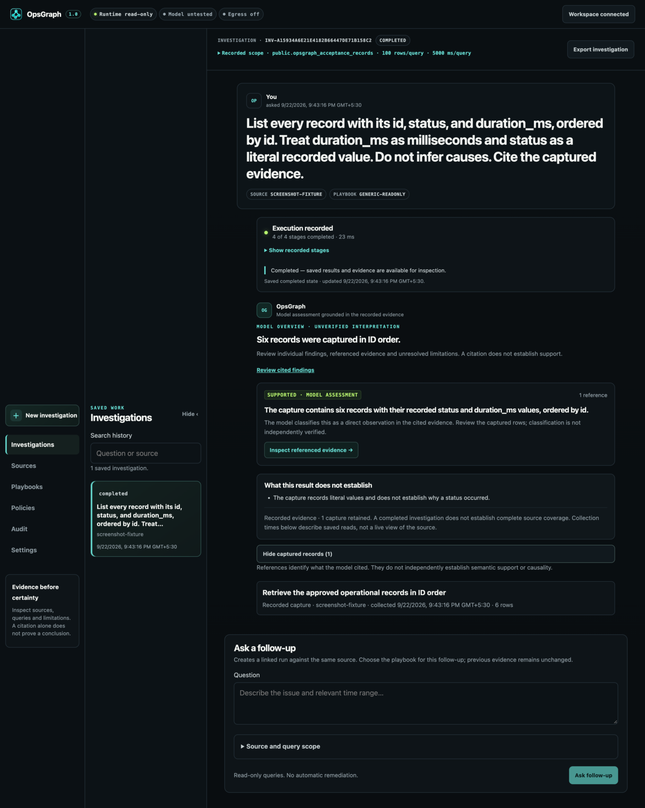

# OpsGraph

**Ask PostgreSQL a question. Inspect the SQL and captured evidence behind the answer.**

[](https://github.com/Arittra-Bag/opsgraph/actions/workflows/ci.yml)
[](LICENSE)
[](https://github.com/Arittra-Bag/opsgraph/releases/latest)

OpsGraph is a self-hosted investigation workspace for one trusted operator. A
configured model proposes bounded PostgreSQL queries; deterministic application
policy and the database role decide what can run. Each finding links back to the
exact SQL, captured records, collection time, source revision, and execution
limits that produced it.

[](docs/assets/opsgraph-investigation-workspace-1.0.png)

*A saved investigation against a six-row test dataset. Open the image for the
full page. The result is historical evidence, independent of the current model
connection.*

[Get started](#get-started) · [Docker](#docker) ·
[First investigation](docs/quickstart.md) · [Supported boundary](docs/production-readiness.md) ·
[Support matrix](docs/release/support-matrix.md)

## Why OpsGraph

- **Evidence stays inspectable.** Open a citation to see the executed query,
  source, timestamps, captured rows, and limits.
- **The model does not control access.** Exact table scope, PostgreSQL
  privileges, AST validation, row and time limits, and read-only transactions
  fail closed outside the model.
- **Setup proves the real path.** Inspect the source, approve a one-row readiness
  read that returns no source value, and probe the actual model before the first
  investigation.
- **Use local or hosted inference deliberately.** Configure Ollama, LM Studio,
  vLLM, OpenAI, Anthropic, OpenRouter, Groq, Together, Mistral, or a manual
  OpenAI-compatible endpoint. Presets provide protocol defaults; you still
  choose and test the exact model.
- **Keep the work.** Reopen history, export evidence, retry with a fresh attempt,
  or ask a linked follow-up that collects new evidence.

FastAPI serves the browser workspace, LangGraph coordinates investigations, and
SQLite stores local history and audit records. PostgreSQL is the only supported
source connector in 1.0.

A valid query, citation, or evidence hash does not prove that a conclusion is
correct. Review the captured records and provide business definitions the schema
cannot express before acting on an answer.

## Get started

You need:

- Python 3.11–3.13, [uv](https://docs.astral.sh/uv/getting-started/installation/),
  Git, and a modern browser.
- A PostgreSQL database you are authorized to inspect, the exact tables you
  intend to expose, and a dedicated login restricted to those tables.
- A structured-output-capable model. For a private local path, install
  [Ollama](https://docs.ollama.com/quickstart) and deliberately download a model,
  for example `ollama pull qwen3:8b`. OpsGraph never downloads a model for you.

Run these commands in Terminal on macOS/Linux or PowerShell on Windows:

```sh
git clone https://github.com/Arittra-Bag/opsgraph.git
cd opsgraph
uv sync --locked --all-extras
uv run opsgraph launch --configure
```

Guided setup creates a private workspace key and asks for the backend-held
database reference, schema ceiling, and initial model settings. The launcher
opens a connected browser; it does not place the database password or workspace
key in the URL.

To stop, press **Ctrl+C**. To return later, run `uv run opsgraph launch` from the
same checkout. Your workspace and history are preserved. Add `--port 8010` when
port 8000 is occupied. See [installation](docs/installation.md) for offline
bundles, native wheel setup, private workspace locations, and troubleshooting.

### First-run checklist

1. **Scope a source.** In **Sources**, reference an allowlisted backend DSN
   variable and enter exact schema-qualified tables. Never paste a DSN into a
   browser field, source name, question, or issue report.
2. **Create a least-privilege login if needed.** The source setup can generate
   reviewable PostgreSQL SQL for an administrator. It never executes that SQL,
   creates a password, or grants future-table access.
3. **Inspect the source.** Inspection checks the real connection, role,
   privileges, exact table scope, and visible columns without inferring business
   meaning.
4. **Configure and test the model.** In **Settings**, choose the connection
   preset, exact model identifier, output profile, timeout, reasoning option,
   and output-token bound. OpsGraph derives the protocol adapter from the
   preset. Save, then run the real structured model probe; saving alone does not
   test the model.
5. **Approve the bounded path.** Return to the inspected source and approve the
   one-row readiness query. OpsGraph records that it executed but does not
   retain or return the selected source value.
6. **Ask a narrow question.** Include the relevant time range and definitions.
   For a compatible table, a useful first question is:

   > List each record with its id, status, and duration_ms, ordered by id. Treat
   > duration_ms as milliseconds and status as a recorded value. Do not infer
   > causes. Cite the captured evidence.

7. **Open the evidence.** Compare the answer with the executed SQL and captured
   rows. Review truncation, missing definitions, contradictory evidence, and
   collection time before relying on it.

Existing installations upgrading to 1.0 must re-inspect each source and run the
new readiness check before starting another investigation. See
[migration](docs/migration.md).

## Remote PostgreSQL

Loopback and Unix-socket PostgreSQL connections are supported directly. Remote
connections require `sslmode=verify-full` so the server certificate and hostname
are verified. Deployments that knowingly accept weaker transport can set
`OPSGRAPH_ALLOW_INSECURE_REMOTE_POSTGRES=true`; this is a compatibility escape
hatch, not the recommended configuration.

The application also rejects roles with effective write privileges on in-scope
application relations, including privileges inherited through membership,
`PUBLIC`, ownership, or column grants. The database role remains the final
authorization boundary.

## Docker

Docker Compose runs the OpsGraph service in a Linux container on Linux, macOS,
or Windows. PostgreSQL and the model runtime remain separate services; the
Compose file does not provision them or download model weights.

Create private configuration first, replace loopback service addresses with
container-reachable addresses, then start:

```sh
uv run opsgraph init
docker compose --env-file .env -f deploy/compose.yaml up --build -d
```

Open `http://127.0.0.1:8000` and connect with the workspace key stored in your
private `.env`. History persists in the `opsgraph-state` volume. Read the
[container guide](docs/installation.md#containers) before enabling model egress
or connecting a remote database. Inside a container, `127.0.0.1` means the
container itself.

## Supported boundary

OpsGraph 1.0 supports one trusted operator per private instance, PostgreSQL
sources, and bounded read-only investigations. Keep the service on loopback or a
private network. The workspace key is a local control, not team identity, SSO,
tenant isolation, or enterprise RBAC.

Each investigation allows at most three queries, 100 captured rows per query,
and five seconds per query unless a playbook imposes stricter limits. Queries run
in repeatable-read, read-only transactions and are rejected when the approved
schema changes before execution.

OpsGraph does not include database writes, automatic remediation, executable
plug-ins, continuous monitoring, team accounts, or connectors for other
databases. It does not automatically discover provider models or switch to a
different provider after failure.

Linux, macOS, and Windows receive native package and fixture CI coverage. A real
PostgreSQL authorization and evidence path runs in Linux CI. Platform-specific
live model evidence and remaining limits are stated precisely in the
[support matrix](docs/release/support-matrix.md); package installation alone is
not described as full end-to-end validation.

## Contributors and coding agents

Keep changes scoped, preserve private workspaces, and never commit `.env`, state
databases, credentials, or real investigation exports. Use disposable resources
for connected tests. From the repository root:

```sh
uv run ruff check src tests scripts
uv run ruff format --check src tests scripts
uv run python -m pytest -q
node --test tests/frontend/*.test.cjs
uv build --build-constraints requirements-build.lock --require-hashes
uv run python scripts/wheel_smoke.py
```

The wheel smoke test expects one wheel in `dist`. Frontend tests require Node.js
(CI uses Node 22). Fixture tests, the connected PostgreSQL control path, live
model probes, and native installer checks prove different properties; do not
collapse them into one claim. Read the [product boundary](docs/product-charter.md),
[connector contract](docs/connector-contract.md), [threat model](docs/threat-model.md),
and [security policy](SECURITY.md) before changing authorization or execution.

## Help, security, and license

- [Installation and troubleshooting](docs/installation.md)
- [Backup, restore, upgrade, and uninstall](docs/maintenance.md)
- [Migration to 1.0](docs/migration.md) · [Changelog](CHANGELOG.md)
- [Report a bug](https://github.com/Arittra-Bag/opsgraph/issues) with the version,
  OS, provider, and sanitized error. Remove credentials and source records.
- [Report a security issue privately](SECURITY.md#reporting-a-vulnerability)

Questions, SQL, captured records, exports, provider settings, and backups may be
sensitive. External inference and tracing are disabled by default; review
[SECURITY.md](SECURITY.md) before connecting operational data.

OpsGraph source is [Apache-2.0](LICENSE). Dependencies retain their own licenses;
release artifacts include the matching notices, dependency inventory, and source
supplement described in [stable distribution](docs/release/distribution.md).
