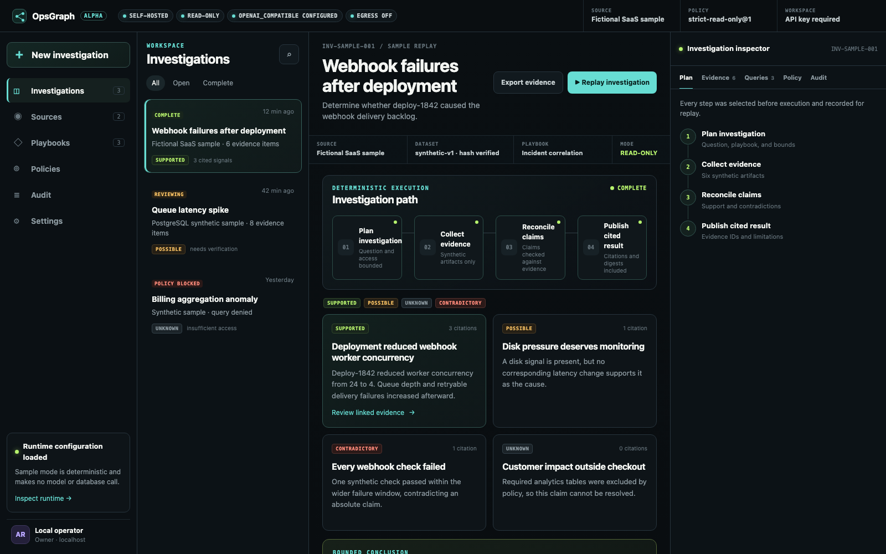

# OpsGraph Alpha

> **Self-hosted, evidence-first PostgreSQL investigations.**
>
> Map an approved schema. Enforce a read-only policy. Return conclusions that
> carry their evidence and audit trail with them.

[](https://github.com/Arittra-Bag/opsgraph/actions/workflows/ci.yml)
[](LICENSE)
[](https://github.com/Arittra-Bag/opsgraph/releases)

<p align="center">
  
</p>

<p align="center"><em>Bundled synthetic sample. No model or database call is made in sample mode.</em></p>

## Why OpsGraph

Most agent interfaces make it easy to ask a question. OpsGraph focuses on the
harder next question: **why should an operator trust what happened next?**

| OpsGraph does | OpsGraph deliberately does not do |
| --- | --- |
| Discovers an approved PostgreSQL schema through a dedicated read-only role | Grant a model direct database credentials or arbitrary SQL execution |
| Validates `SELECT` queries against PostgreSQL AST, table scope, row and time bounds | Perform remediation, writes, dump restoration, or executable plug-ins |
| Derives evidence coverage from source-owned table bindings | Let a model self-assert that its evidence is sufficient |
| Records evidence hashes and a local tamper-evident audit chain | Claim production/customer-data approval in this alpha |

## What ships in Alpha

- **Self-hosted control plane** — no cloud account required for the synthetic
  sample.
- **PostgreSQL connector** — live schema discovery through a separately
  provisioned read-only role.
- **Policy-gated evidence broker** — AST validation plus database-native
  read-only transactions, bounded rows, timeouts, schema and table scope.
- **Provider choice** — deterministic replay by default; Ollama/vLLM through
  an OpenAI-compatible adapter; Anthropic only after explicit egress opt-in.
- **Customizable declarative skills** — versioned skill definitions with
  per-tool bounds that can tighten, never weaken, server policy.
- **Inspectable results** — cited conclusions, known limitations, evidence
  digests, and an audit chain.

## Alpha boundary

This is a **public validation alpha**. It is intended for synthetic data and
non-production replicas. It is not approved for production or customer data.
Read [SECURITY.md](SECURITY.md) and the [threat model](docs/threat-model.md)
before connecting any source.

## Quick start

```bash
python3.11 -m venv .venv
source .venv/bin/activate
python -m pip install -e '.[providers,dev]'
cp .env.example .env
opsgraph doctor
opsgraph serve --reload
```

If the prompt shows `(.venv)` but `python` or `uvicorn` still resolves outside
this folder, refresh the shell activation before running:

```bash
deactivate 2>/dev/null || true
source .venv/bin/activate
rehash
python -c "import sys, opsgraph; print(sys.executable); print(opsgraph.__file__)"
python -m uvicorn opsgraph.api.app:app --reload
```

Open <http://127.0.0.1:8000>. The bundled sample workspace requires no database,
model, cloud account, or outbound network access.

Enter the `OPSGRAPH_API_KEY` value from your local `.env` in the workspace-key
drawer. Sample replay remains the safest first run.

## Connect an approved PostgreSQL source

1. Create a dedicated login that cannot create roles/databases, bypass RLS, or
   write any target table. Grant it only the `SELECT` and schema `USAGE` needed.
2. Put its DSN in a local environment variable such as
   `OPSGRAPH_SOURCE_DSN`. Do not paste the DSN into the UI.
3. Configure either an OpenAI-compatible loopback endpoint (Ollama/vLLM) or
   Anthropic in `.env`. Loopback inference needs no external-egress permission;
   Anthropic requires `OPSGRAPH_EGRESS_ENABLED=true` deliberately.
4. In **Sources**, save the environment-variable name, an explicit allowlist of
   schema-qualified tables, and source-owned evidence bindings (for example,
   `job_status=public.jobs`). OpsGraph verifies the role and saves only the
   approved schema slice before marking it ready. An empty table scope cannot
   be used for a connected investigation; a selected skill also cannot run
   until every evidence type it requires is bound to an approved source table.
5. Start a new investigation. The model proposes at most three SELECT queries;
   PostgreSQL AST validation, policy, row bounds, timeout, and a read-only
   transaction are enforced before execution.

External providers receive the question, approved schema metadata, and bounded
evidence required for synthesis only when that source has explicitly opted in to
external egress. Use a local provider when this data must not leave the host.
Credentials are never included in provider prompts.

The Compose profile can reach an explicitly configured database or provider;
for non-local deployments, restrict that network path with host-level egress
allowlists. OpsGraph's application egress switch is a second control, not a
replacement for network policy.

## Skills and tools

Skills are strict, versioned YAML/JSON definitions. Each skill declares its
tool allowlist and may tighten row, timeout, schema, and table bounds. It cannot
weaken the server policy or remove the native `core.schema.inspect` tool.
Third-party executable Python plug-ins are deliberately not supported in this
alpha.

## Trust boundary

The model never receives database credentials and never decides authorization.
Every operation is typed, evaluated by policy, bounded by the broker, converted
to evidence, and appended to the audit chain before its result is returned.
Evidence-type coverage is derived from PostgreSQL AST-confirmed source tables,
not self-declared by the model.

See [SECURITY.md](SECURITY.md), [product charter](docs/product-charter.md), and
[threat model](docs/threat-model.md) before connecting any non-synthetic source.
OpsGraph is licensed under [Apache-2.0](LICENSE).

## Launch notes and feedback

Read [public launch notes](docs/public-launch.md) for the exact public-alpha
claims, screenshots, and feedback questions. Issues and focused security
reports are welcome; please use the security contact and boundary in
[SECURITY.md](SECURITY.md) for sensitive reports.

## Development

```bash
pytest -q
ruff check src tests
```

## Container quick start

Copy `.env.example` to `.env`, set a long `OPSGRAPH_API_KEY`, then run:

```bash
docker compose -f deploy/compose.yaml up --build
```

The default container remains synthetic, deterministic, and egress-off. For a
connected PostgreSQL run, explicitly set `OPSGRAPH_MODE=connected`, the source
DSN environment variable named by `OPSGRAPH_POSTGRES_SECRET_REF` (or an entry in
`OPSGRAPH_ALLOWED_POSTGRES_SECRET_REFS`), a table
allowlist in the UI, and (only for cloud providers) `OPSGRAPH_EGRESS_ENABLED=true`.
Restrict database/provider network routes outside the container as well.

The alpha has automated contract and adversarial tests, but it is not yet
approved for production or customer data. See `SECURITY.md` for the exact
boundary and report security issues privately.
