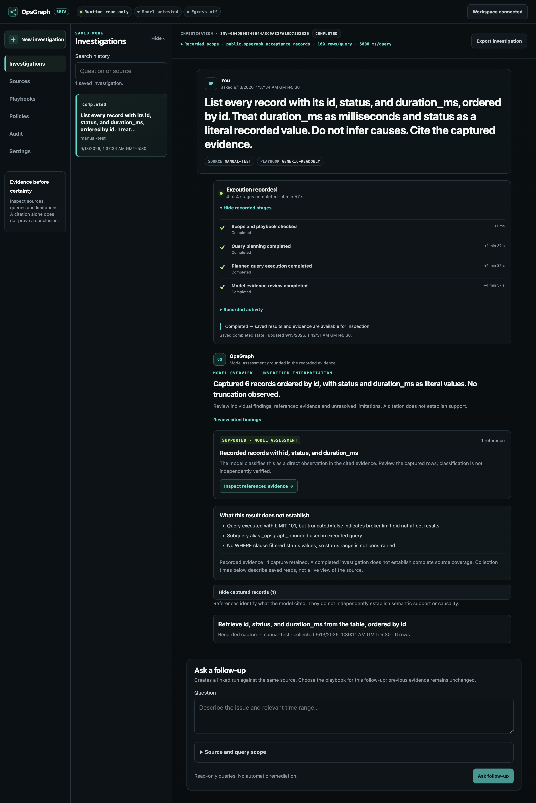

# OpsGraph

**Ask your PostgreSQL data a question. Inspect the evidence behind the answer.**

[](https://github.com/Arittra-Bag/opsgraph/actions/workflows/ci.yml)
[](LICENSE)

OpsGraph is an open-source, self-hosted investigation workspace for one operator.
Your model plans bounded, read-only queries; application policy controls their
execution. You can follow the work, inspect captured records and SQL, and ask a
follow-up that collects fresh evidence. Credentials stay on your backend.

[](docs/assets/opsgraph-investigation-workspace-beta.png)

*A real saved investigation against a six-row test dataset. Open the image for
the full page. Its saved result is separate from the current model connection status.*

[Get started](#get-started) · [Docker](#run-with-docker) ·
[Quickstart](docs/quickstart.md) · [Support matrix](docs/release/support-matrix.md)

## Why OpsGraph?

- **See what happened.** Follow recorded execution, then open a citation to inspect
  the query, source, collection time, captured rows and limits.
- **Keep control of access.** Choose explicit PostgreSQL tables and use a dedicated
  read-only role. The model cannot grant itself access or make database changes.
- **Use your model.** Run locally with Ollama without a paid account, or configure
  an OpenAI-compatible service or Anthropic with explicit external-data permission.
- **Keep the investigation.** Reopen history, export evidence, challenge a finding
  with a linked follow-up, or retry a failed attempt with fresh queries.

FastAPI serves the browser workspace, LangGraph coordinates investigations, and
SQLite stores local history. PostgreSQL is the supported database connector.
A citation or matching hash does not prove a conclusion true: review the records
and supply any missing business definitions before acting on an answer.

## Get started

**The first beta is being prepared; it has not been published yet.** Use the
source checkout below today. When available, versioned offline bundles and their
checksums will appear on the [releases page](https://github.com/Arittra-Bag/opsgraph/releases).
The [bundle quickstart](docs/quickstart.md) explains installation and verification.
Older alpha downloads do not contain the current beta workflow.

You need:

- Git, [uv](https://docs.astral.sh/uv/getting-started/installation/) and Python
  3.11–3.13 for the source path, plus a modern browser.
- An authorized **non-sensitive PostgreSQL test database**, a dedicated read-only
  login, and the names of the tables you want to inspect. Ask your database
  administrator for these if you do not have them; setup does not create them.
- A running model. For the tested local path, install
  [Ollama](https://docs.ollama.com/quickstart), then deliberately run
  `ollama pull qwen3:8b`. This downloads several GB; OpsGraph never downloads models
  for you. Allow 2 GiB of installation headroom plus model storage and memory.

### Linux, macOS and Windows

Run these commands in Terminal on macOS/Linux or PowerShell on Windows:

```sh
git clone https://github.com/Arittra-Bag/opsgraph.git
cd opsgraph
uv sync --locked --all-extras
uv run opsgraph launch --configure
```

Setup asks for your database connection string (DSN), approved schemas and model.
For Ollama on the same host, use `http://127.0.0.1:11434/v1` and your installed
model identifier. If your runtime uses another port, enter that port. Setup
creates the private workspace key and opens a connected browser automatically.
No manual key generation is needed for the launcher-opened browser.

To stop, press **Ctrl+C** in the terminal. To return later, run
`uv run opsgraph launch` from the same checkout; your workspace and history are
preserved. If port 8000 is occupied, add `--port 8010`. For private workspace
locations, separate-browser access and recovery, see the [quickstart](docs/quickstart.md).

| Environment | Validation available for this beta |
| --- | --- |
| macOS 26 arm64 | CI fixtures and offline installer lifecycle; real PostgreSQL/model workflow exercised locally on macOS 26.2 |
| Linux: Ubuntu 24.04 x64 | CI fixtures and offline installer lifecycle; full native database/model workflow not yet verified |
| Windows Server 2025 x64 | CI fixtures and offline installer lifecycle; Windows 11 and full native database/model workflow not yet verified |
| Docker | Image configuration and health checks; complete container investigation workflow not yet verified |

These checks cover different things; see the [support matrix](docs/release/support-matrix.md)
for exact versions and provider coverage. This is a public validation beta for
one operator, not a stable or production-ready release.

## Your first investigation

1. **Connect the source.** In Sources, keep `OPSGRAPH_SOURCE_DSN` as the backend
   reference, enter your actual schema-qualified tables, then save and inspect.
   Review the discovered columns. Leave optional playbook mappings empty for
   general investigations.
2. **Test the model.** In Settings, choose the provider and model, save, then select
   **Test actual model connection**. Saving alone does not test it. The test sends
   a structured request without source records.
3. **Ask a question.** Select New investigation, your source and General read-only.
   Start with a small, concrete request, such as:

   > List the id, status and duration_ms of each record, ordered by id. Treat
   > duration_ms as milliseconds and status as a recorded value. Do not infer
   > causes. Cite the captured evidence.

   Use this example only if your inspected table has those columns and meanings;
   adapt it to your own schema. The screenshot's test table is not bundled data.
4. **Check the answer.** Watch recorded activity, then open referenced evidence.
   Compare the answer with the captured rows and SQL. Review any limits or missing
   evidence. Export the investigation if needed; exports can contain sensitive data.

No database yet? You can configure and test the model first, but a real
investigation needs a real source. OpsGraph does not substitute sample answers.

## Run with Docker

Docker Compose can run the OpsGraph backend on Linux, macOS or Windows with Linux
containers. PostgreSQL and the model runtime are separate services; Compose does
not provision them or download model weights.

From the checkout, first [create a private configuration and set container-reachable
addresses](docs/installation.md#containers), then start:

```sh
docker compose --env-file .env -f deploy/compose.yaml up --build -d
```

Open `http://127.0.0.1:8000` and connect with the workspace key from your private
`.env`. History stays in the `opsgraph-state` Docker volume. The
[container guide](docs/installation.md#containers) includes host networking,
permissions, logs, stop and restart commands. Inside a container, `127.0.0.1`
means that container, not your host computer.

## Limits and recovery

Each investigation allows up to three SELECT queries, 100 captured rows per query
and five seconds per query; playbooks may impose stricter limits. PostgreSQL AST
validation, approved table scope, role checks and read-only transactions enforce
access. No database writes, automatic remediation, team accounts, CDC or
executable third-party plugins are included in this beta.

Reloading reconnects to saved work. Cancellation waits for the active operation
to exit and stops further scheduling. Interrupted runs keep captured evidence;
retry starts a fresh attempt. Follow-ups link to earlier work and query again.

One narrowly detected answer inconsistency can trigger an answer-only correction
using the same evidence. This does not rerun SQL or establish arbitrary business
meaning. A second inconsistent answer fails visibly and preserves the evidence.
There is no simulated progress or automatic fallback to another model.

## For contributors and coding agents

Use the source setup above. Keep changes scoped, preserve private workspaces and
never commit `.env`, database files, credentials or real investigation exports.
Use disposable test resources for live tests. From the repository root:

```sh
uv run ruff check src tests scripts
uv run ruff format --check src tests scripts
uv run python -m pytest -q
node --test tests/frontend/*.cjs
uv build --build-constraints requirements-build.lock --require-hashes
uv run python scripts/wheel_smoke.py
```

The wheel smoke test expects one wheel in `dist`; keep older build artifacts
outside that folder. Frontend tests need Node.js (CI uses Node 22). Ordinary tests use fixtures;
real PostgreSQL/model acceptance is opt-in. Passing fixture tests does not prove
a live deployment works. Read the [product boundary](docs/product-charter.md),
[connector contract](docs/connector-contract.md) and [security policy](SECURITY.md)
before changing execution or access behavior.

## Help, security and license

- [Installation and troubleshooting](docs/installation.md)
- [Upgrade, backup, restore and uninstall](docs/maintenance.md)
- [Migration from alpha](docs/migration.md) · [Changelog](CHANGELOG.md)
- [Report a bug](https://github.com/Arittra-Bag/opsgraph/issues): include the version,
  OS, provider and sanitized error; remove credentials and source records.
- [Report a security issue privately](SECURITY.md#reporting-a-vulnerability)

Protect your workspace and backups: questions, SQL and captured records can be
sensitive. External inference and tracing are off by default; see
[SECURITY.md](SECURITY.md) before connecting data.

OpsGraph's own source remains [Apache-2.0](LICENSE). Dependencies retain their
licenses; accompanying source, notices and GPL/LGPL obligations for the integrated
bundle are described in [beta distribution](docs/release/beta-distribution.md).
