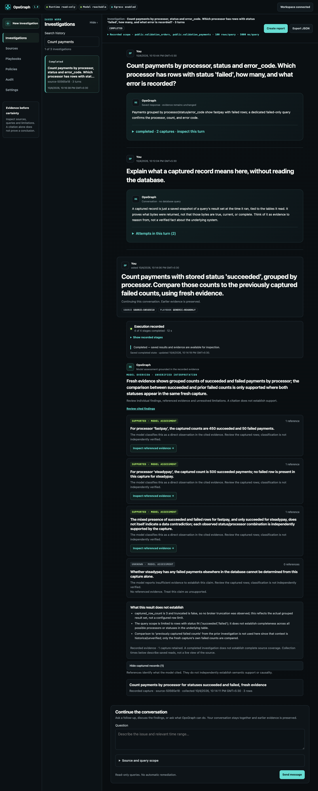

# OpsGraph

**Ask PostgreSQL a question. Check the records behind the answer.**

[](https://github.com/Arittra-Bag/opsgraph/actions/workflows/ci.yml)
[](LICENSE)
[](https://github.com/Arittra-Bag/opsgraph/releases)

A private, self-hosted workspace for investigating missing records, failed
payments and stuck jobs. Ask a question, inspect the SQL and saved results,
then continue in the same conversation. Export a readable incident report when
another engineer needs the evidence.

[Get started](#get-started) · [First investigation](#first-investigation) ·
[Stop and return](#stop-and-return) · [Setup guide](docs/quickstart.md) ·
[Security](SECURITY.md)

[](docs/assets/opsgraph-investigation-workspace-1.0.png)

*Live-tested with Anthropic and synthetic Supabase payment data. An incident
question, a conversation without a database query, and a follow-up using fresh
evidence stay together. Click the image for the full page.*

## Get started

You need **Git**, **Python 3.9 or newer**, and a browser. The installer prepares
OpsGraph's own Python environment and asks before downloading software.

On macOS or Linux, open Terminal and run:

```sh
git clone https://github.com/Arittra-Bag/opsgraph.git
cd opsgraph
python3 Start.py --no-code
```

On Windows, use PowerShell and replace the last line with `py Start.py --no-code`.
Already cloned? Run the last command from your `opsgraph` folder.

Choose your path:

| Choice | What you need | What happens |
| --- | --- | --- |
| **Try with practice data** | PostgreSQL 15-18 installed, or local Docker Desktop running | Creates a separate database with invented orders and payments and a read-only login |
| **Connect my database** | A PostgreSQL connection string with a restricted read-only login | Guides you through your hosting provider's connection settings |

Then choose a model service: your own hosted API key, or an already running
local model. OpsGraph does not install PostgreSQL or download model files.
The setup asks before saving and opens your private workspace in the browser.
Passwords and keys stay on your backend and are hidden while you type them.

Need help getting a database login? Choose the setup help option, or skip the
connection and use the administrator guide in **Sources** later. Never use your
database owner's login. [Step-by-step setup](docs/quickstart.md#no-code-setup).

## First investigation

1. **Sources:** choose the tables OpsGraph may read. Check the connection and
   approve the small test read. Practice setup can do this after your approval.
2. **Settings:** save your model choice, then click **Test actual model connection**.
3. **Investigations:** ask a specific question and open the cited evidence.

For the included practice database, try:

> Count payments by processor, status and error_code. Which processor has failed
> payments, how many are there, and what error is recorded? Cite the evidence.

Continue with follow-ups in the same investigation. Earlier results stay saved,
and retries keep their own attempts. Product questions do not read your database.
Use **Create report** to preview and download Markdown. Choose whether to include
SQL and source records, and review the content before sharing.

## Stop and return

Press **Ctrl+C** in the launch terminal. Closing the browser does not stop OpsGraph.
Return with the same command from the same checkout:

```sh
python3 Start.py --no-code
```

Your settings and history stay saved. To review setup again:

```sh
python3 Start.py --no-code --configure
```

To update, stop OpsGraph, [back up your workspace](docs/maintenance.md#backup-and-restore),
then run `git pull --ff-only` and the same launch command. It prepares the updated
application when needed. [Maintenance and recovery](docs/maintenance.md).

## Connections and privacy

Use local or hosted PostgreSQL, including Supabase, Neon, AWS RDS, Google Cloud
SQL, Azure and DigitalOcean. Hosting choices supply setup guidance, not provider
certification. Remote connections verify the server's certificate and hostname
with `sslmode=verify-full`. [Connection guide](docs/hosted-postgresql.md).

Use Ollama, LM Studio, vLLM, Anthropic, OpenRouter, OpenAI, Groq, Together,
Mistral, or a compatible custom endpoint. You choose and test the model. OpsGraph
does not automatically discover models or switch providers after a failure.

External model processing requires explicit permission. Approved schema,
questions and bounded query results may reach that provider. Local inference
is available when you supply a local model. Reports and backups can contain
sensitive data. [Security and data handling](SECURITY.md).

## Supported boundary

One trusted operator, PostgreSQL, and read-only investigations. Keep the service
on your computer or a private network. The model proposes queries, while
application checks and PostgreSQL permissions decide what can run.

Each data attempt allows at most three queries, 100 captured rows per query and
five seconds per query, with stricter playbook limits where applicable. Changing
an approved schema invalidates its previous checks. A citation or matching hash
does not prove an answer correct. Review evidence and supply business definitions.

No database writes, automatic fixes, team accounts or continuous monitoring.
[Validation and platform limits](docs/release/support-matrix.md) ·
[Production boundary](docs/production-readiness.md).

## Other setup options

- **Quick or Advanced:** `python3 Start.py` uses the original guided workspace.
  [Installation options](docs/installation.md#guided-source-installation).
- **Docker:** runs the application container. Your database and model remain
  separate. [Container setup](docs/installation.md#containers).
- **Offline bundles:** use an artifact matching its published version and platform.
  [Bundle guide](docs/installation.md#guided-offline-bundle).

<details>
<summary>Development checks</summary>

Keep changes scoped and never commit credentials, state databases or private
exports. Run from the repository root:

```sh
uv run ruff check src tests scripts Start.py
uv run ruff format --check src tests scripts Start.py
uv run python -m pytest -q
node --test tests/frontend/*.test.cjs
uv build --build-constraints requirements-build.lock --require-hashes
uv run python scripts/wheel_smoke.py
```

The wheel smoke test expects one wheel in `dist`. Frontend tests need Node.js.
Read the [connector contract](docs/connector-contract.md) and
[threat model](docs/threat-model.md) before changing execution or access controls.

</details>

[Report a bug](https://github.com/Arittra-Bag/opsgraph/issues) with your version,
OS and sanitized error. [Report security issues privately](SECURITY.md#reporting-a-vulnerability).
[Changelog](CHANGELOG.md) · [Backup and restore](docs/maintenance.md) ·
[Upgrade notes](docs/migration.md).

Licensed under [Apache-2.0](LICENSE). Dependencies retain their own licenses.
