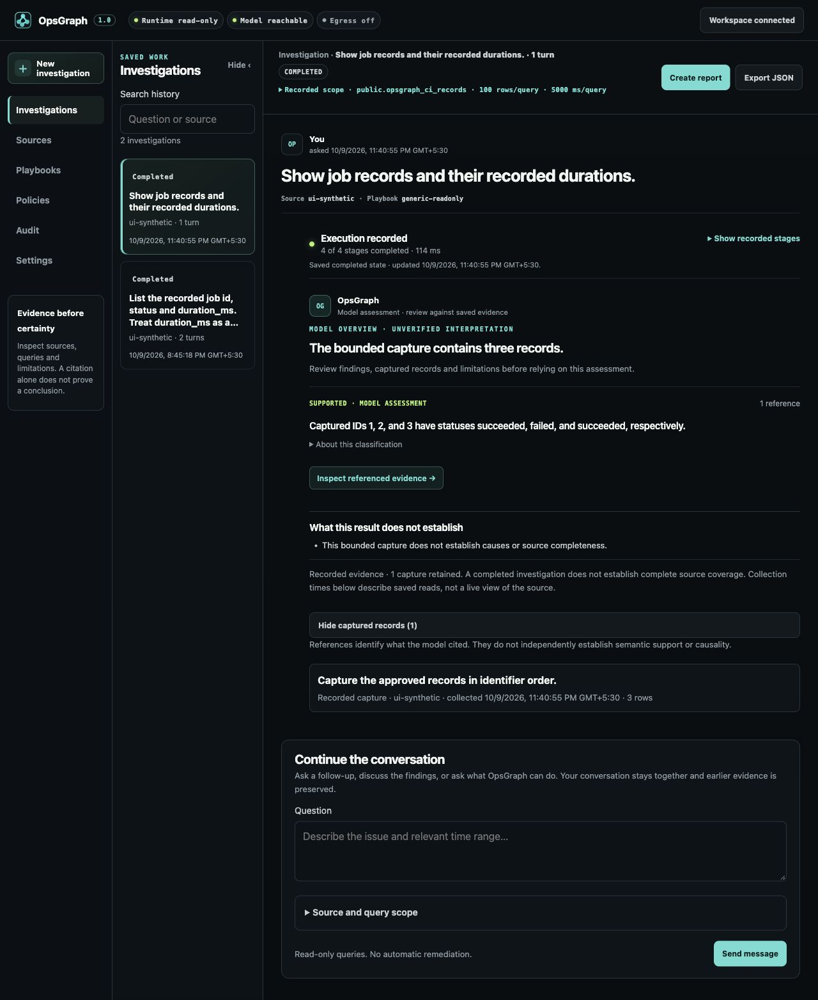

# Investigation UI refinement

The investigation view keeps the existing dark palette and conversation model.
Navigation and history use less width. Questions, assessments, limitations and
captured records have a clearer hierarchy with fewer nested panels.

The editable [design direction](https://www.figma.com/design/kwfhkCQpE6fdGps72gtcFe)
contains three compact frames: desktop conversation, evidence detail and narrow
conversation. It uses synthetic records and the application's existing palette.
It is a design reference, not proof of backend behavior. Theme switching is deferred.

## Review decisions

| Responsibility | Finding and resolution |
| --- | --- |
| Frontend | Navigation could focus a hidden history heading. Focus now targets visible content. Historical disclosure focus and expanded state survive refreshes. Selecting a turn brings its question and author into view without interrupting typing during a slow load. |
| Backend contracts | Late cancellation or retry responses could replace a newer selection. Responses now check workspace, selected attempt and selection generation. No backend or policy changes were needed. |
| UI and accessibility | Narrower navigation initially clipped the New investigation label. Wrapping fixes it. Long toolbar titles truncate visually while the complete question remains available. Native disclosures retain keyboard behavior. |
| Product | Evidence inspection buried SQL below detailed provenance. SQL and rows now follow a compact source/time/bounds summary. Older-turn inspection explains where a follow-up continues and offers Return to latest turn. Partial captures are labelled separately from completed assessments. |
| Build and deployment | Canonical and preview assets remain identical. Hash-constrained wheel and source builds include the UI. This PR does not invoke release publication or deploy production. |
| Performance | No new dependencies. Select indicators use one shared local SVG. Control feedback changes color and rotates disclosure indicators without moving controls. The earlier intermediate layout patch added approximately 1.2 KB compressed across HTML/CSS/JS. Historical rendering still grows with turn count, as before. |

## Browser journey notes

Tests used Chromium, a disposable loopback PostgreSQL 16 database, a dedicated
SELECT-only role and a local model protocol fixture. Records and answers in these
screenshots are synthetic. This tests application behavior and protocol handling,
not model quality or live hosted-provider compatibility.

| Action | Observed result and copy review |
| --- | --- |
| Open an empty workspace | Connection and setup requirements appear without invented results. |
| Connect workspace | Authentication loads saved sources and history. |
| Configure source | Hosting guidance, explicit table scope and external processing permission remain available. |
| Save and inspect | Actual PostgreSQL metadata appears. Inspection alone does not complete bounded readiness. |
| Approve bounded readiness | One constant-only read succeeds without retaining source values. |
| Check model | A structured request is required. Saving configuration alone does not show a reachable model. |
| Ask a question | Execution stages and recorded state are visible. The completed assessment retains limitations and evidence controls. |
| Ask a follow-up | Two turns remain in one investigation history entry. Earlier evidence remains unchanged. |
| Reload | History, selected attempt and conversation reload from persisted state. Model checks can expire independently. |
| Inspect an older turn | A notice explains that messages continue from the latest turn. Return to latest turn navigates correctly. |
| Inspect evidence | SQL, three rows and effective bounds are available. Capture identity, fingerprints and exact canonical hash input remain in disclosures. |
| Use keyboard in drawer | Background is isolated, Shift+Tab wraps within the drawer, Escape closes it and returns focus to the trigger. |
| Create a report | Preview warns that content is not automatically redacted. Download remains disabled until review is confirmed. Markdown and JSON downloads were inspected. |
| Return invalid model output | The attempt fails while its capture remains inspectable as partial evidence. No invalid assessment is accepted. |
| Retry | A successful replacement attempt stays in the same turn and retains failed-attempt history. |
| Cancel a delayed operation | The UI first shows cancellation requested, then confirmed cancelled state. It does not report cancellation prematurely. |
| Resize | At 320, 390, 768 and 1280 px, document width equals viewport width. Essential actions remain available. SQL and tables scroll within their containers. |

No warning or error console entries were recorded during the integrated journey.

## Validation

- Full Python suite: 1,056 passed, 10 skipped, one dependency deprecation warning.
  Skips are opt-in live acceptance, schema mutation and native Windows checks.
- Dependency-free frontend suite: 183 passed, including new selected-operation
  race, navigation/focus, disclosure persistence, evidence order and escaping tests.
- Opt-in native no-code regression and stress check: one passed. It uses temporary
  practice PostgreSQL data and loopback services, checks denied writes, authentication,
  idempotent resume and an absent model remaining unready.
- Connected control-path smoke: passed against real local PostgreSQL and a protocol
  fixture. Checks database and application write denial, bounded readiness,
  provider save/restart/probe, history after restart, capture export and credential
  exclusion from public API responses.
- Ruff lint and formatting, dependency lock check, JavaScript syntax and diff checks:
  passed. Wheel assets match canonical source byte for byte.
- Build review: two earlier hash-constrained offline builds were byte-identical.
  The final source was rebuilt after subsequent UI adjustments.
- Core text contrast against the panel background: muted 6.42:1, faint 7.42:1,
  cyan 11.36:1 and lime 14.06:1.
- Markup-generation benchmark: 250 synthetic turns, 200 samples after warmup,
  median 0.649 ms before and 0.705 ms after the intermediate patch. This is string
  generation, not browser rendering or interaction latency.

Browser timing APIs were unavailable. Frame timing and INP were not measured.
Hosted databases, external paid models and every operating-system combination
were not exercised live. Existing provider, hosting and policy tests remain part
of the regression suite. These checks are not an accessibility certification.

Read-only execution, approved table scope, query/row/time bounds, external-model
permission, backend credentials, saved history and evidence provenance are unchanged.

## Screenshots

[Completed investigation](assets/ui-refinement/investigation.jpg),
[evidence detail](assets/ui-refinement/evidence.jpg),
[narrow conversation](assets/ui-refinement/mobile.jpg),
[narrow evidence](assets/ui-refinement/mobile-evidence.jpg),
[report preview](assets/ui-refinement/report.jpg),
[cancellation](assets/ui-refinement/cancelled.jpg).

## References

Native [details and summary](https://developer.mozilla.org/en-US/docs/Web/HTML/Reference/Elements/details)
keep disclosure controls keyboard accessible. [Focus with preventScroll](https://developer.mozilla.org/en-US/docs/Web/API/HTMLElement/focus)
and [scrollIntoView](https://developer.mozilla.org/en-US/docs/Web/API/Element/scrollIntoView)
separate focus restoration from selected-turn positioning.

## Control alignment follow-up

Disclosure indicators share an 8 px centered chevron with a 10 px label gap.
Select indicators are centered vertically, inset 12 px from the right edge,
with 44 px reserved so text cannot overlap them. Settings-specific styles no
longer override these dimensions. Native select menus and details semantics remain.

Browser checks cover composer, model settings, source setup, execution stages,
classification, evidence provenance and history controls. Disclosures and key
actions have at least 44 px targets. Drawer close is 44 by 44 px. Space, Enter,
Escape and focus return were verified. Feedback uses 120 ms color changes and
140 ms chevron rotation, with no spatial movement on press. Reduced motion
disables these transitions and forced colors restores native select indicators.
The media-query fallbacks were reviewed in source, not emulated in the browser.

The follow-up also checked 320, 390, 768 and 1280 px layouts with no page-wide
horizontal overflow or console warnings/errors. At narrow widths, nested padding
is 16 px for the composer and 12 px for scope, giving select fields more room.
The full regression suite passed again: 1,056 Python tests and 183 frontend tests.
One earlier local run stopped progressing in the simulated process-interruption
fixture. That fixture passed independently and the fresh complete suite passed;
no fixture, dependency or backend behavior was changed to obtain the result.

## Icons and header glass

Navigation, evidence references and the report action use local 20 px line icons.
Labels remain visible and accessible, with 10 px gaps and at least 44 px controls.
All six navigation destinations, evidence keyboard activation, report preview and
Escape focus return passed in Chromium using copied synthetic history.
At 320, 390, 768, 901 and 1280 px, labels fit and page width matches viewport width.
No warning or error console entries were recorded. No live model or database was called.

Glass is limited to the workspace header and drawer headers. Captured records,
SQL and findings remain opaque. Solid backgrounds work without backdrop-filter;
reduced transparency and forced colors disable blur. These fallbacks were reviewed
in source, not browser emulated. Parallax was omitted after design review because
the working canvas has no suitable decorative surface.

The full suite passed: 1,056 Python tests, 10 opt-in/platform skips and 183 frontend
tests. The existing dependency warning remains. Lint, format, syntax, mirror and
diff checks passed, and the built wheel retains the new sprite and exact UI assets.
